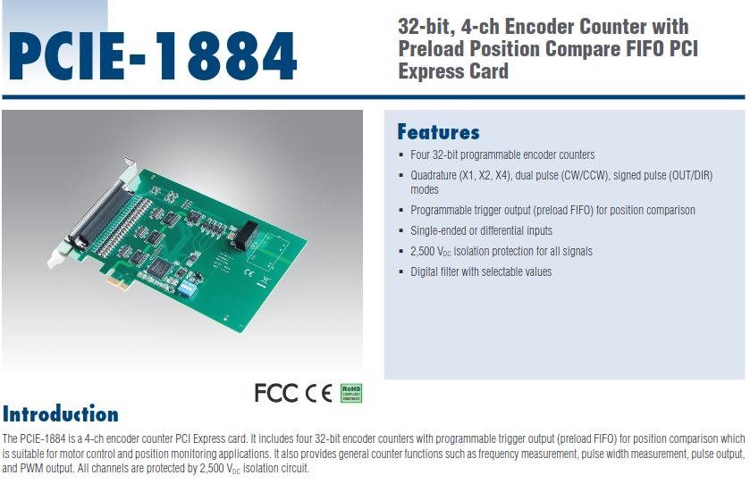

# Linux-CNCReceiver-Counter-PCIE-1884

Desktop computer counter running Linux Ubuntu 20.04 receiving count of signals driving the CNC milling machine using the Advantech PCIE-1884 Card.

Wassalam.
WRY

